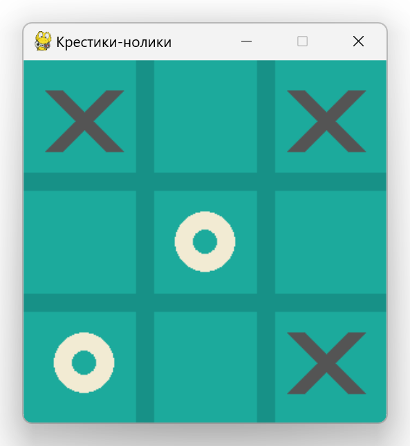

# Tic-Tac-Toe

## Selecting the language in the README file

[Документация на русском](docs/READMEru.md)

## Description

The "Tic-Tac-Toe" game with a graphical interface implemented using the `pygame` library.



## Project Structure

```plaintext
project/
├── gameparts/
│   ├── __init__.py         # Initialization of the gameparts package
│   ├── Board.py            # Game board logic
│   ├── exceptions.py       # Exceptions (not yet used)
├── game.py                 # Main file to run the game
├── test_board.py           # Tests for the game board logic
└── README.md               # Project documentation
```


### How to Use

Clone the repository

```
git clone https://github.com/DKMFzF/tic-tac-toe.git
```

Create a virtual environment and install dependencies

```
python -m venv venv

--------------------------------------
source venv/Scripts/activate # Windows
source venv/bin/activate # Linux
--------------------------------------

pip install -r requirements.txt
```

Run the game

```
python game.py
```

### Author  
[Kirill Doroshev (DKMFzF)](https://vk.com/dkmfzf )

### License

This project is licensed under the MIT license