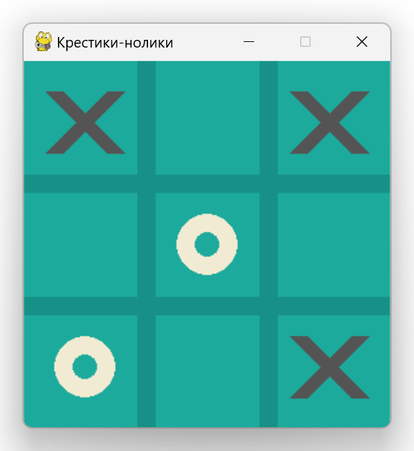

# Крестики-нолики

## Описание

Игра "Крестики-нолики" с графическим интерфейсом, реализованным с помощью библиотеки `pygame`.



## Структура проекта

```plaintext
project/
├── gameparts/
│   ├── __init__.py         # Инициализация пакета gameparts
│   ├── Board.py            # Логика игрового поля
│   ├── exceptions.py       # Исключения (пока не используется)
├── game.py                 # Основной файл для запуска игры
├── test_board.py           # Тесты для логики игрового поля
└── README.md               # Документация проекта
```


### Как использовать:

Для начала нужно клонировать репозиторий
```
git clone https://github.com/DKMFzF/tic-tac-toe.git
```

После создать виртуальное окружение и установить зависимости
```
python -m venv venv

--------------------------------------
source venv/Scripts/activate # Windows
source venv/bin/activate # Linux
--------------------------------------

pip install -r requirements.txt
```

Запустить игру
```
python game.py
```

### Автор  
** [Дорошев Кирилл (DKMFzF)](https://vk.com/dkmfzf ) **

### Лицензия

Этот проект лицензирован по лицензии MIT
